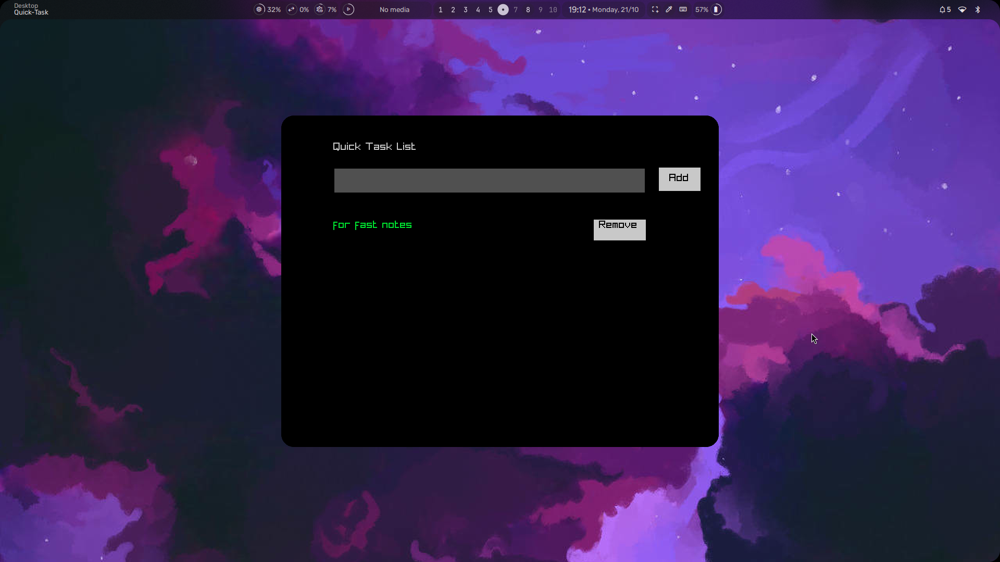

# QuickTask
## A simple tasklist app i made while trying the raylib library binding on golang
**Uses sqlite as database**

## Requirements

    Go 1.16 or later
    Raylib-Go (for rendering the GUI)
    SQLite3 (for database storage)

## Installation
1. Clone the Repository
```
git clone https://github.com/SyedAsadK/Quicktask
cd Quicktask

```
2. Install Dependencies
Ensure that you have all required Go modules installed. You can do this by running:
```
go mod tidy

```
3. Build the Application
To build the application, use the go build command:
```
cd bin
go build -o quicktask

```
This will create a quicktask executable in the current directory.

4. Run the Application
After building the application, you can run it:
```
./quicktask

```
## Showcase

